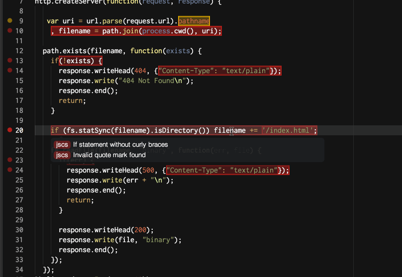

# Linter

Lint your code with ease in [Atom](http://atom.io).

The idea is to stop the linter plugins war, by providing a top level API for linters to parse and display errors in the Atom editor.

## Available linters
- [linter-php](https://atom.io/packages/linter-php), for PHP using `php -l`
- [linter-phpcs](https://atom.io/packages/linter-phpcs), for PHP, using `phpc`
- [linter-phpmd](https://atom.io/packages/linter-phpmd), for PHP, using `phpmd`
- [linter-pylint](https://atom.io/packages/linter-pylint), for Python, using `pylint`
- [linter-pyflakes](https://atom.io/packages/linter-pyflakes), for Python, using `pyflakes`
- [linter-pep8](https://atom.io/packages/linter-pep8), for Python, using `pep8`.
- [linter-flake8](https://atom.io/packages/linter-flake8), for Python, using `flake8`
- [linter-pylama](https://atom.io/packages/linter-pylama), for Python, using `pylama`
- [linter-javac](https://atom.io/packages/linter-javac), for Java, using `javac`
- [linter-jshint](https://atom.io/packages/linter-jshint), for JavaScript and JSON, using `jshint`
- [linter-jscs](https://atom.io/packages/linter-jscs), for JavaScript, using `jscs`
- [linter-jsxhint](https://atom.io/packages/linter-jsxhint), for JSX (React.js), using `jsxhint`
- [linter-eslint](https://atom.io/packages/linter-eslint), for JavaScript, using `eslint`
- [linter-scss-lint](https://atom.io/packages/linter-scss-lint), for SASS/SCSS, using `scss-lint`
- [linter-less](https://atom.io/packages/linter-less), for LESS, using `less`
- [linter-coffeelint](https://atom.io/packages/linter-coffeelint), for CoffeeScript, using `coffeelint`
- [linter-csslint](https://atom.io/packages/linter-csslint), for CSS, using `csslint`
- [linter-rubocop](https://atom.io/packages/linter-rubocop), for Ruby and Ruby on Rails, using `rubocop`
- [linter-tslint](https://atom.io/packages/linter-tslint), for Typescript, using `tslint`
- [linter-xmllint](https://atom.io/packages/linter-xmllint), for XML, using `xmllint`
- [linter-shellcheck](https://atom.io/packages/linter-shellcheck), for Bash, using `shellcheck`
- [linter-scalac](https://atom.io/packages/linter-scalac), for Scala, using `scalac`
- [linter-clang](https://atom.io/packages/linter-clang), for C / C++, using `clang`
- [linter-cpplint](https://atom.io/packages/linter-cpplint), for C++, using `cpplint`
- [linter-ruby](https://atom.io/packages/linter-ruby), for Ruby, using `ruby -wc`
- [linter-lua](https://atom.io/packages/linter-lua), for Lua, using `luac -p`
- [linter-clojure](https://atom.io/packages/linter-clojure), for Clojure, using `clojure`
- [linter-puppet-lint](https://atom.io/packages/linter-puppet-lint), for Puppet, using `puppet-lint`
- [linter-js-yaml](https://atom.io/packages/linter-js-yaml), for Yaml, using `js-yaml`
- [linter-erb](https://atom.io/packages/linter-erb), for .erb files, using `erb -x`
- [linter-hlint](https://atom.io/packages/linter-hlint), for Haskell files, using `hlint`
- [linter-tidy](https://atom.io/packages/linter-tidy), for HTML, using `tidy`
- [linter-htmlhint](https://atom.io/packages/linter-htmlhint), for html, using `htmlhint`
- [linter-squirrel](https://atom.io/packages/linter-squirrel), for squirrel, using `squirrel-compiler`
- [linter-codscriptizer](https://atom.io/packages/linter-codscriptizer), for CoDScript, using `codscriptizer -l`
- [linter-harbour](https://atom.io/packages/linter-harbour), for Harbour, using `harbour`
- [linter-rust](https://atom.io/packages/linter-rust), for Rust, using `rustc`
- [linter-dartanalyzer](https://atom.io/packages/linter-dartanalyzer), for Dart using `dartanalyzer`

## Features

* **Lint on edit** – Instant error reporting for you! (And it's fast!)
* **Modular** – You install only the linters you need.
* **Active** – New linters are out every week.

## Installation

1. `$ apm install linter` – Install the main package.
2. `$ apm install linter-jshint` – Install the linter you need, here `jshint`.

## Configuration

* **Lint on save** [On / Off] - Lint the file when you save it
* **Lint on change** [On / Off] - Lint the file as you type
* **Show highlighting** [On / Off] - Highlight the range of wrong code
* **Show gutters**: [On / Off] - Show dot in the gutter on line error
* **Show messages around cursor** [On / Off] - Show error description in the status bar
* **Show status bar when cursor is in error range** [On / Off] - Either show status bar when the cursor is on the error line, or show it when the cursor is focus the range of wrong code
* **Show error inline** [On / Off] - Shows the error or warning message next to the code as opposed to in the status bar.
* **Lint on change interval** [in ms] - Interval between two lints while you are writing code

## Common errors

* `env: node: No such file or directory` – There's a problem with your node path – [check this](http://stackoverflow.com/a/20077620).
* `spawn ENOENT` or `spawn ENOTDIR` - A linter can't find a path to the executable. Try starting Atom from a shell via `atom` to make sure it gets your `PATH`. See also [#102](https://github.com/AtomLinter/Linter/issues/102), [#150](https://github.com/AtomLinter/Linter/issues/150).
* Gutters and highlights not working? Make sure you're using the React editor. The [old editor is deprecated](http://blog.atom.io/2014/07/22/default-to-react-editor.html).

## Documentation
http://atomlinter.github.io/Linter/

## Coming soon

- linter-pep257, for python, using `pep257`.
- linter-rst, for reStructuredText, using `docutils`.
- linter-phplint, for PHP, using `phplint`.
- linter-jsl, for JavaScript, using `jsl`.
- linter-oclitnt, for C / C++ / Objective-C, using `OCLint`.

## Contributing

If you're going to submit a pull request, please try to follow
[the official contribution guidelines of Atom](https://atom.io/docs/latest/contributing).

You need `nodejs` and `grunt-cli` installed before contributing.
Run `bower install node` then `npm install -g grunt-cli`.

Also, run `$ grunt dev` before any submission and while developing, it will achieves severals tasks:

* Compile and lint the CoffeeScript files
* Lint the stylesheets
* Lint any trailing spaces and ensure new line at end of file

You can generate the doc with `$ grunt doc`, it will open in your default browser.

## Donation

